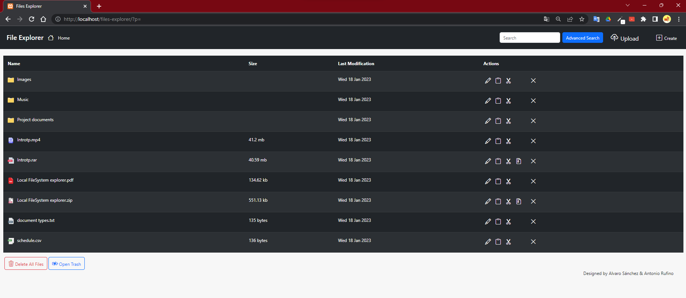
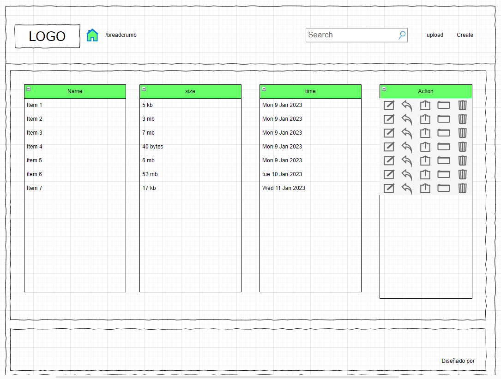

`#html` `#css` `#js` `#php` `#master-in-software-development`

# PHP Local FileSystem 

  

>In this project we create a system file explorer that allows the user to navigate, create directories and upload files in the same way as he would in his usual operating system. 

>The file explorer is a tool that allows you to directly view and manipulate the files and directories associated with a path, so you must take into account from which path the user starts and which path they can access.

## Index <!-- omit in toc -->

- [PHP Local FileSystem](#php-local-filesystem)
  - [Wireframe](#wireframe)
  - [ShowCase Diagram](#showcase-diagram)
  - [Repository](#repository)

## Wireframe

## Repository

First of all you must fork this project into your GitHub account.

To create a fork on GitHub is as easy as clicking the “fork” button on the repository page.

