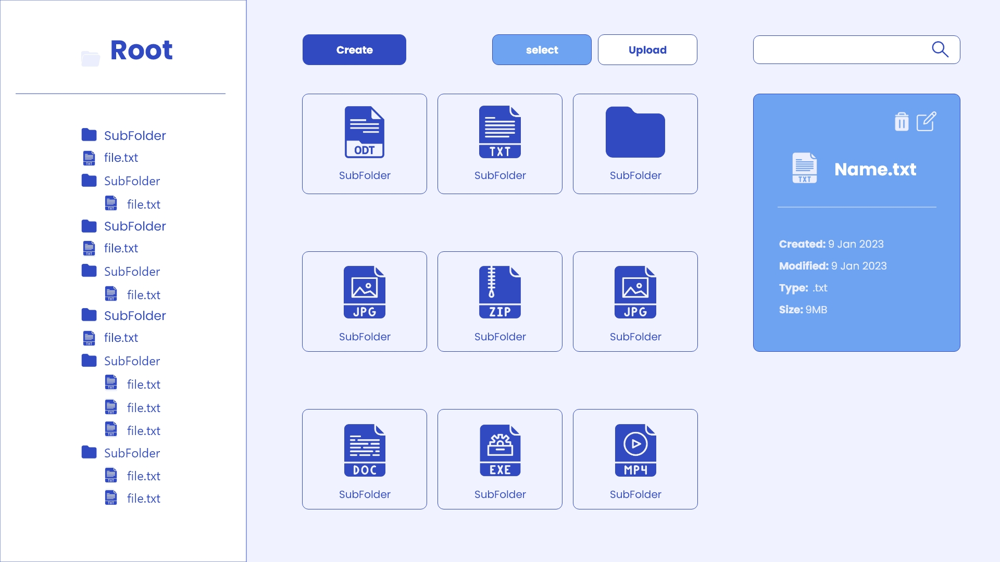

# PHP Local FileSystem explorer <!-- omit in toc -->

## Details

>DESCRIPTION:

>We have developed this project using the POST method in HTML forms in order to better understand how it works. We've tried to FETCH requests from JS but we've run out of time to understand all the issues we're running into. We made a view of nested folders so that the user would know in which directory he is at any moment. Our file system is capable of browsing and creating folders and subfolders, creating new folders, and uploading folders and files with the required extensions.Shows information related to the date of creation of folders and files, date of last access along with the weight and type of extension of each file. We have also implemented a button to delete both files and folders and the ability to rename them. Secondly we have not had time to implement the function of searching for folders and files and being able to understand the fetch requests in order to implement them. Because of this we have all used the POST method in the HTML forms for development.

>Challenges: 

>This project has been a real challenge for us and we have tried to solve most of them by our own means, such as paths, recursive functions, sessions, specific PHP functions.

>Organization and distribution of tasks:

>We have tried to distribute the work in the most equitable way possible, solving each problem point by point and doing a lot of peercoding.
>We have done a lot of fusion of ideas and debated different ways to achieve the objectives

>In the future:

>Later, we would like to finish implementing all the necessary features for this project such as the search bar, understand more in depth the fetch requests in order to give it more dynamism. We would also like to implement a nested accordion menu and make a recycle bin. On the other hand, we are very happy with the result obtained and we have worked a lot on logic and teamwork.

## How to Use the Project

>To visualize the project you need to simulate a local server through XAAMP to visualize the content: <a>www.apachefriends.org</a.

## Wireframe

>Before:

>1-idea 

>2-idea

>Final result

## Diagram

## Requirements

- You cannot use file third-party libraries ✔
- You will not be able to use global variables in PHP. ✔
- You must use GIT ✔
- You must use the PHP > v8 ✔
- Create a clear and orderly directory structure ✔
- Both the code and the comments must be written in English ✔
- Use the camelCase code style to define variables and functions ✔
- In the case of using HTML, never use inline styles ✔
- In the case of using different programming languages ​​always define the implementation in separate terms ✔
- Remember that it is important to divide the tasks into several sub-tasks so that in this way you can associate each particular step of the construction with a specific commit ✔
- You should try as much as possible that the commits and the planned tasks are the same ✔
- Delete files that are not used or are not necessary to evaluate the project ✔

## Repository

https://github.com/88jose/filesystem-explorer.git

## Technologies used

\* HTML ✔

\* CSS ✔

\* JS ✔

\* PHP ✔

\* <i> We have yet to understand the FETCH requests in more depth to be able to implement the functionalities in a more dynamic way. </i>

## Resources

- [File system](https://es.wikipedia.org/wiki/Administrador_de_archivos)
- [PHP FileSystem W3C](https://www.w3schools.com/php/php_ref_filesystem.asp)
- [PHP FileSystem Oficial](https://www.php.net/manual/es/book.filesystem.php)
- [README Guidelines Example](https://gist.github.com/PurpleBooth/109311bb0361f32d87a2)
- [++] (https://www.youtube.com/ - https://stackoverflow.com/ - https://stackoverflow.es/ )
